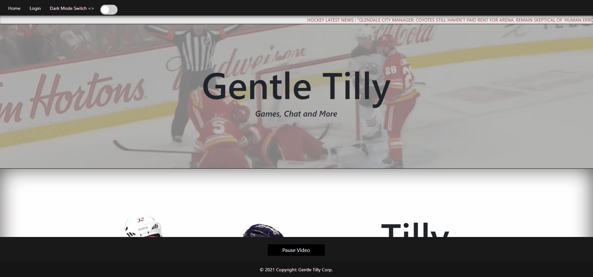

# Gentle Tilly!

## Description

## Table of Contents

- [Installation](#installation)
- [Usage](#usage)
- [License](#license)
- [Wireframe](#wireframe)
- [Contributing](#contributing)
- [Tests](#tests)
- [Questions](#questions)

## User Stories

* As a user, I want to be able to create an account.

* As a user, I want be able to login.

* As a registered user, I want to see a list of current hockey games.

* As a registered user, I want to be able to select the game and see some info;

* As a registered user, I want to be able to leave comments;

## Installation 

- Clone the repo to the working directory | `gh repo clone Valllerian/gentle-tilly`;
- Enter working directory;
- Make sure to install dependencies `npm install`
- Source the database using seeds function in `/seeds` folder;
- Run the local server to see the content;

## Usage

Find deployed app on heroku:

## Wireframe
    
- Main page layout with being unauthorized;

 

 

- Main page after logging in; Search prompt appears;

 

 

- Search page with an alias dropdown ;

 

 

- Single game page (closed game shows score);

 

 

- Single game page (scheduled game shows networks to view the game on);

 

 

- Adding comment generates a comment section with comment body and an avatar;

 

 

- Main Page styled with a background video (toggle button available);

 

 

- Dark mode switch is available;

 

 

- Future development includes profile page content + comment history;

 

 

## License

Copyright [2021] 

Permission is hereby granted, free of charge, to any person obtaining a copy of this software and associated documentation files (the "Software"), to deal in the Software without restriction, including without limitation the rights to use, copy, modify, merge, publish, distribute, sublicense, and/or sell copies of the Software, and to permit persons to whom the Software is furnished to do so, subject to the following conditions:

The above copyright notice and this permission notice shall be included in all copies or substantial portions of the Software.

THE SOFTWARE IS PROVIDED "AS IS", WITHOUT WARRANTY OF ANY KIND, EXPRESS OR IMPLIED, INCLUDING BUT NOT LIMITED TO THE WARRANTIES OF MERCHANTABILITY, FITNESS FOR A PARTICULAR PURPOSE AND NONINFRINGEMENT. IN NO EVENT SHALL THE AUTHORS OR COPYRIGHT HOLDERS BE LIABLE FOR ANY CLAIM, DAMAGES OR OTHER LIABILITY, WHETHER IN AN ACTION OF CONTRACT, TORT OR OTHERWISE, ARISING FROM, OUT OF OR IN CONNECTION WITH THE SOFTWARE OR THE USE OR OTHER DEALINGS IN THE SOFTWARE.

Find more information at https://opensource.org/licenses/MIT.
    
## Contributing
    
- Fork the repo at | `gh repo clone Valllerian/gentle-tilly`;
- Create a working branch | `git checkout -b yourname-branch`;
- Commit any changes | `git commit -m 'Your changes here'`  *please, make sure to comment your commits*;
- Push your changes to the branch | `git push  yourname-branch`
- Submit a pull request;
- Cooperate on the pull request form if any questions/issues added;
    
## Tests
    
N\A
    
## Questions
    
- Feel free to add any issues and contact me at valeriibihun.co@gmail.com if you have any questions;

- Follow my code: https://github.com/valllerian;
